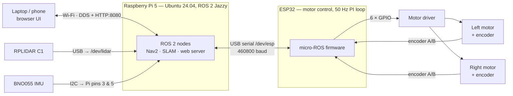
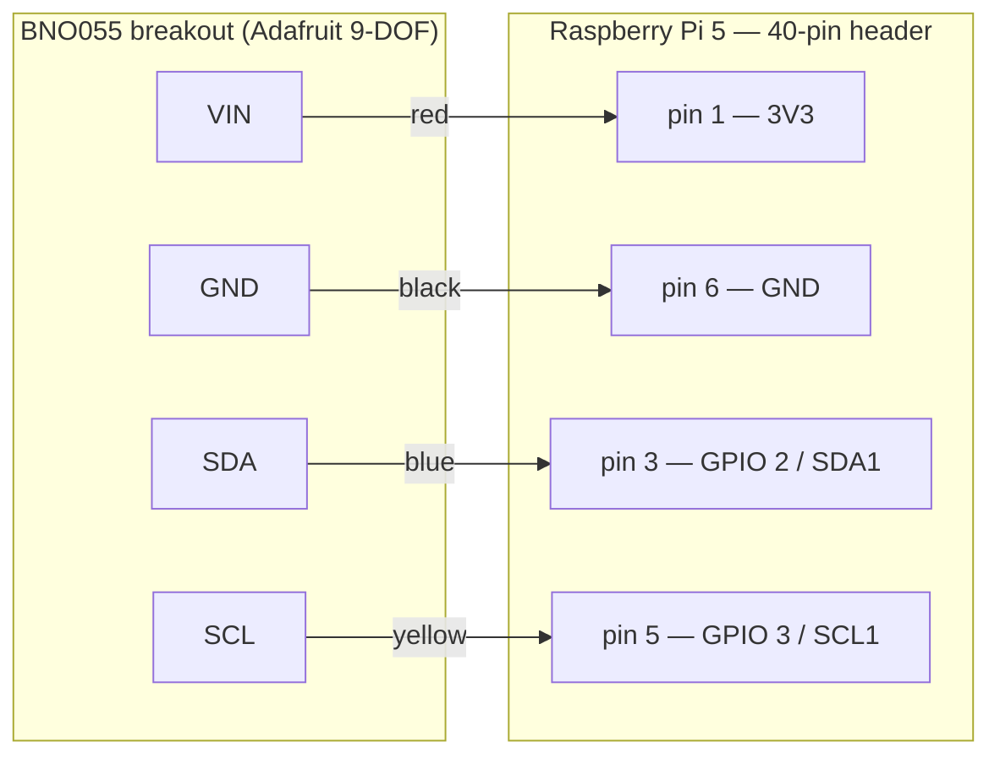
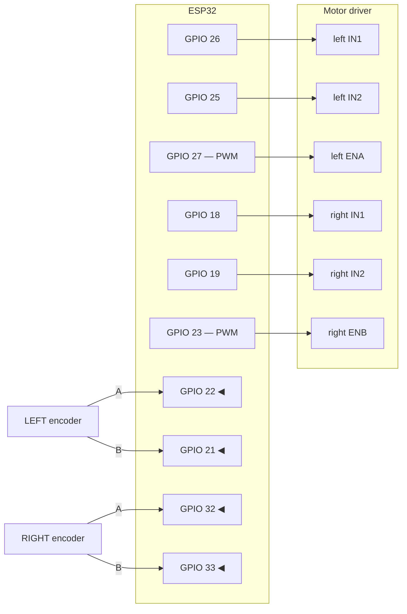
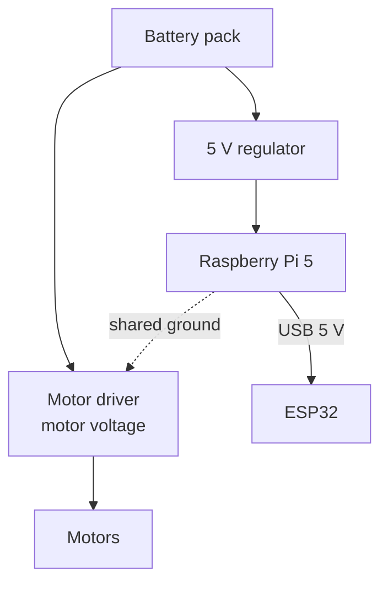
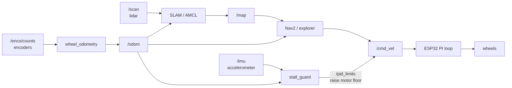

# Nexva — how it all connects

A wiring and data-flow map for anyone building, repairing or re-cabling this robot.
You should be able to work from this page alone, with a multimeter and the parts in front of you.

> **Pin numbers here come from the firmware that actually runs**
> (`Testing/ESP/microros_code/microros_code.ino`), not from prose. Where the older
> `circuit.txt` disagrees, this page is right and `circuit.txt` is wrong — see
> [Known conflicts](#known-conflicts-read-before-wiring). Wire to the firmware.

---

## 1. The whole robot at a glance



Three devices hang off the Pi: **two on USB** (lidar, ESP32) and **one on the I2C header pins**
(IMU). The ESP32 hosts no network of its own — it is a USB device on the Pi, and the laptop
reaches it only through the Pi.

---

## 2. BNO055 IMU → Raspberry Pi

**Four wires. These go to the PI, not the ESP32.**



| BNO055 | Pi pin | Signal | Why this one |
|---|---|---|---|
| VIN | **1** | 3V3 | the breakout regulates 3–5 V; 3V3 keeps I2C at the Pi's logic level |
| GND | **6** | GND | **must** share ground with the Pi or I2C never settles |
| SDA | **3** | GPIO 2 | bus 1 data — pull-ups are already on the breakout |
| SCL | **5** | GPIO 3 | bus 1 clock |

> ⚠️ **The mistake that has already happened on this robot:** the IMU was wired to the
> **ESP32's** I2C. The ROS driver runs on the **Pi**, so from the Pi's side the bus is simply
> idle and `i2cdetect -y 1` comes back completely empty — every address `--`. No software check
> can detect this. If you see an empty scan, check which board the wires actually land on before
> anything else.

**Verify:** `./tools/check_imu.sh` on the Pi. It walks Pi → I2C enabled → tools → *does anything
answer* → libraries → a real read, and stops at the first genuine failure. `i2cdetect -y 1`
should show `28` (or `29` if the ADR pad is pulled high).

---

## 3. ESP32 → motor driver and encoders



| ESP32 GPIO | Goes to | Dir | Notes |
|---|---|---|---|
| **26** | left IN1 | out | direction |
| **25** | left IN2 | out | direction |
| **27** | left ENA | out | PWM, 1 kHz, 8-bit |
| **18** | right IN1 | out | direction |
| **19** | right IN2 | out | direction |
| **23** | right ENB | out | PWM, 1 kHz, 8-bit |
| **22** | left encoder A | in | interrupt |
| **21** | left encoder B | in | sampled in the handler, for direction |
| **32** | right encoder A | in | interrupt |
| **33** | right encoder B | in | sampled in the handler, for direction |

The ESP32 must **share ground with the motor driver**, and the motor rail must **not** be taken
from the same regulator that feeds the Pi — motor current spikes will brown the Pi out. That
shows up as random reboots or as `vcgencmd get_throttled` reporting under-voltage, visible in
the web UI's **Diagnostics** tab.

---

## 4. USB devices → Pi

| Device | Port | Baud | Set by |
|---|---|---|---|
| RPLIDAR C1 | `/dev/lidar` | 460800 | udev rule |
| ESP32 | `/dev/esp` | 460800 | udev rule |

Both are **udev aliases**, not raw `/dev/ttyUSB*` — the kernel hands those out in plug order, so
a lidar that enumerates first one boot and second the next would silently swap the two. If a
device is missing, check the alias exists before suspecting the hardware:

```bash
ls -l /dev/esp /dev/lidar
```

---

## 5. Power



Two rules, both learned the hard way:

1. **Share the ground.** Pi, ESP32 and motor driver must all sit on a common ground, or I2C and
   the serial link misbehave in ways that look like software faults.
2. **Do not share the regulator** between the motor rail and the Pi. Motors pull hundreds of
   milliamps in spikes; the Pi browns out and reboots.

---

## 6. What flows where, once it is all connected



Note that `/odom` is derived **on the Pi**, not the ESP32: `nav_msgs/Odometry` is 724 B against
a 512 B serial MTU, and fragmenting it once stalled the whole link to 1 Hz. The ESP32 sends raw
counts; the Pi does the maths.

---

## Known conflicts — read before wiring

`Docs/circuit.txt` is older and **disagrees with the running firmware** in two places. Wiring to
it will produce a robot that looks electrically fine and behaves wrongly:

| What | `circuit.txt` says | Firmware actually uses | Effect of following circuit.txt |
|---|---|---|---|
| Left motor direction | IN1 = GPIO 25, IN2 = GPIO 26 | **IN1 = 26, IN2 = 25** | left wheel drives **backwards** |
| Encoders | left 34/36, right 35/39 | **left 22/21, right 32/33** | **no counts at all** — odometry dead |

`circuit.txt` also describes a `/vac_main1` namespace and node names (`esp32_bridge`,
`odom_guard`) that belong to a different robot; treat its ROS sections as historical.

---

## Bring-up order


1. Wire everything above; double-check ground and the IMU's board.
2. `./tools/check_imu.sh` on the Pi — must reach the end.
3. `./robotbring.sh` (terminal 1) — waits for `/scan`, `/odom` and the `odom → base_footprint`
   transform, then says READY.
4. `./robotnav.sh` (terminal 2), `./web.sh` (terminal 3).
5. **Bench-check the IMU axes before trusting the stall guard:**
   `ros2 run nexva_sensor imu_monitor` — turning the robot **left must increase yaw**. The guard
   integrates *forward* acceleration, so a board mounted the wrong way makes every one of its
   thresholds meaningless. Fix with `axis_remap:=`.

See [LAUNCHES.md](LAUNCHES.md) for what each script does and
[ARCHITECTURE.md](ARCHITECTURE.md) for what each package contains.
